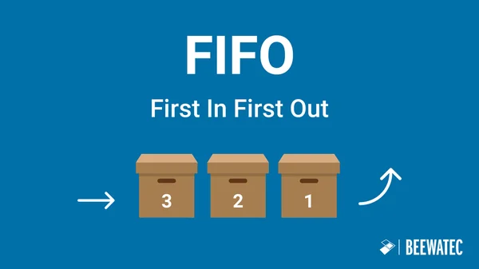

# Pilas y Colas

## Pilas
* Basadas en LIFO (Last-In, First-Out)

<div align="center">
    <p>
        
    </p>
</div>

### Uso básico
Se pueden crear usando listas en python, con los métodos `.append()` y `.pop()`.

**Ejemplo:**
```python
pila = []
pila.append(10)
pila.append(20)
pila.pop()
```

## Colas
* Basadas en FIFO (First-In, First-Out)

<div align="center">
    <p>
        
    </p>
</div>

### Uso básico
Se pueden crear usando listas en python, pero es ineficiente, con los métodos `.append()` y `.pop(0)`.

**Ejemplo:**
```python
cola = []
cola.append(10)
cola.append(20)
cola.pop(0)
```

## Uso de bibliotecas
La biblioteca `collections` contiene estructuras como `deque`, que facilitan la creación de pilas y colas.

**Ejemplo Pila:**
```python
from collections import deque

pila = deque()
pila.append(10)
pila.append(20)
pila.pop()
```

**Ejemplo Cola:**
```python
from collections import deque

cola = deque()
cola.append(10)
cola.append(20)
cola.popleft(0)
```

## Colas de Prioridad
* Basadas en asignar una prioridad a los elementos

### Uso básico
Se pueden crear usando listas en python con tuplas como elementos.
Después de añadir elementos se debe ordenar la lista.
Se trabaja como una cola una vez que está ordenada.

**Ejemplo:**
```python
cola_p = [(1, "A"),(8, "C"),(4, "B")]	#(Prioridad, Valor)
cola_p = sorted(cola_p) 	#Por defecto, sorted funciona

cola_p.append([3, "Z"])
cola_p = sorted(cola_p)

cola_p.pop(0)
```

## Uso con biblioteca
La biblioteca `heapq` está optimizada para colas de prioridad.

**Ejemplo Pila:**
```python
import heapq

cola_p = [(8, "C")]
heapq.heappush(cola_p, (1, "A"))
heapq.heappush(cola_p, (4, "B"))
heapq.heappop(cola_p)
```