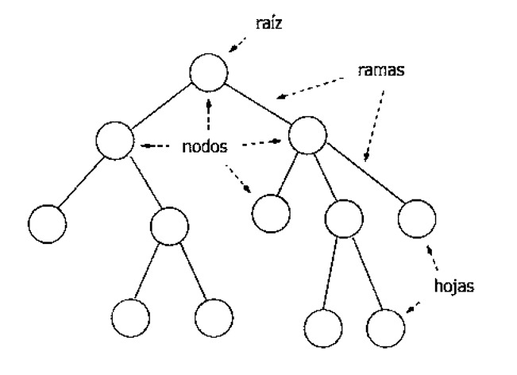

# Árboles
Estructura no lineal conformada por:

- Nodo: Es la unidad básica, debe contener: Un valor y las referencias a sus otros nodos (hijos).
- Raíz: Es el nodo superior, el único que no tiene un nodo padre.
- Hoja: Son los nodos finales, los únicos que no tienen nodos hijos.
- Padre: Un nodo se considera nodo padre si tiene al menos un nodo conectado debajo.
- Hijo: Un nodo se considera hijo si depende o está conectado a un nodo superior.
- Sub-árbol: Se puede decir que un árbol está conformado por sub-árboles.
- Altura: Preferiblemente se empieza a contar en 0 (o sea si solo existe el nodo raíz, la altura es 0).
- Profundidad: Es la distancia desde la raíz hasta cualquier nodo.

<div align="center">
    <p>
        
    </p>
</div>

## Árbol binario
Cada nodo tiene máximo 2 hijos (izquierdo y derecho).

<div align="center">
    <p>
        
    </p>
</div>

### Implementación utilizando POO
```python
class Nodo:
    def __init__(self, valor):
        self.valor = valor
        self.izq = None
        self.der = None

# EJEMPLO
raiz = Nodo(10)

raiz.izq = Nodo(5)
raiz.der = Nodo(20)

raiz.izq.izq = Nodo(3)
raiz.izq.der = Nodo(7)
```

## Formas de recorrer un árbol
- Preorden: Raíz -> Izquierda -> Derecha
- Inorden: Izquierda -> Raíz -> Derecha
- Postorden: Izquierda -> Derecha -> Raíz

**Ejemplo**
```python
def preorden(nodo):
    if nodo == None:
        return

    print(nodo.valor)

    preorden(nodo.izq)
    preorden(nodo.der)
```