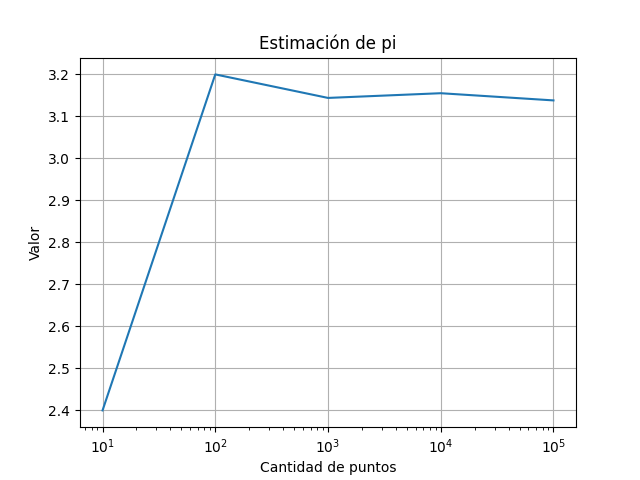

# Tarea 2
## Descripción
Esta tarea consiste en desarrollar un programa en Python que estime el valor de π utilizando puntos aleatorios.

El programa deberá calcular aproximaciones con diferentes números aleatorios (el proceso se explicará más adelante), mostrar el porcentaje de error respecto al valor real de π y generar una gráfica.

Puede utilizar funciones encontradas internet o generadas con IA para el desarrollo de esta tarea, sin embargo, debe añadir comentarios indicando de donde obtuvo la información, que prompts usó si se generó con IA y en que le ayudó esa información.

---

## Enunciado

Desarrolle un programa que utilice la siguiente lista de cantidades de puntos:

```python
[10, 100, 1000, 10000, 100000]
```

Para cada valor `N` de la lista:

1. Genere `N` valores aleatorios para `x`.
2. Genere `N` valores aleatorios para `y`.
3. Determine cuáles puntos cumplen:

x^2+y^2\leq1

4. Cuente cuántos puntos cumplen con la condición anterior.
5. Calcule una aproximación de π utilizando:

\pi\approx4\left(\frac{puntos\ dentro}{N}\right)

6. Investigue y utilice el módulo `math` para obtener el valor real de π.
7. Calcule el error porcentual de cada aproximación utilizando:

error=\frac{|\pi_{real}-\pi_{aproximado}|}{\pi_{real}}\times100

8. Muestre en la terminal:

   * el valor de `N`,
   * la aproximación obtenida con 6 decimales,
   * y el error porcentual con 2 decimales.

Una vez calculadas todas las aproximaciones:

* Guarde los resultados en una lista. 
* Genere una gráfica utilizando `matplotlib` donde:

  * El eje `X` represente la cantidad de puntos.
  * El eje `Y` represente las aproximaciones de π.
* Utilice escala logarítmica en el eje `X` con `plt.xscale(log)`.
* Agregue:

  * título,
  * etiquetas en los ejes,
  * y malla con `plt.grid()`.

---

## Ejemplo
Recuerde que al ser números aleatorios su resultado va a ser distinto.

Terminal:

```python
N = 10      : 2.400000 | Error: 23.61%
N = 100     : 3.200000 | Error: 1.86%
N = 1000    : 3.144000 | Error: 0.08%
N = 10000   : 3.155200 | Error: 0.43%
N = 100000  : 3.138080 | Error: 0.11%
```

Gráfico:

<div align="center">
    <p>
        
    </p>
</div>

---

## Criterios de Evaluación

- **Uso de NumPy para generar puntos aleatorios (10%)**
- **Uso de NumPy para la condición (`x**2 + y**2 <= 1`) (10%)**
- **Uso de NumPy para contar puntos dentro (10%)**
- **Uso de Matplotlib para crear el gráfico correctamente (6%)**
- **Uso de Matplotlib con escala logarítmica y malla (5%)**
- **Uso de Matplotlib para mostrar el gráfico (6%)**
- **Investigación y uso de `math` (6%)**
- **Cálculo correcto del porcentaje de error (10%)**
- **Uso de diferentes valores de N (5%)**
- **Cálculo del valor aproximado de pi (10%)**
- **Almacenamiento de las aproximaciones (6%)**
- **Impresión de resultados con decimales correctos (6%)**
- **Comentarios completos (10%)**